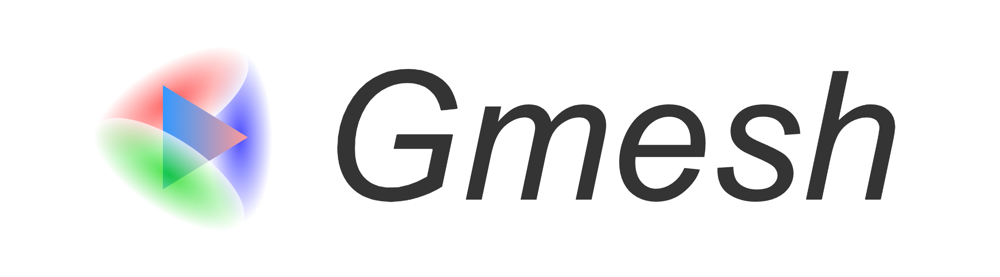
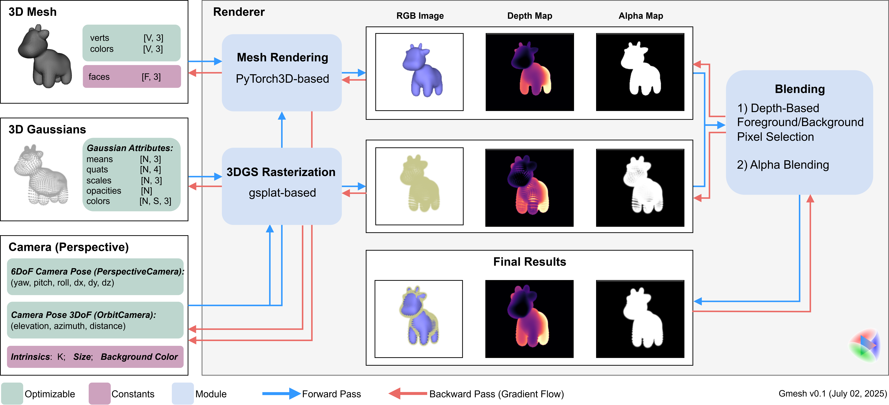
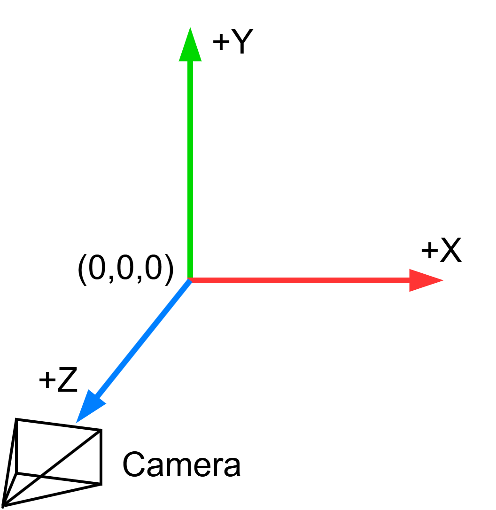

<p align="center">
    
</p>

<h1 align="center">Differentiable Hybrid Renderer for 3D Gaussians & Mesh</h1>


<a href="https://opensource.org/licenses/MIT">

</a>

**Current Version**: v0.1 (July 02, 2025)

## TL;DR

- Combining Gaussians and meshes lets you leverage the strengths of both for more flexible and realistic 3D scene rendering.
- Gmesh supports differentiable rendering of mixed 3D Gaussians and meshes within a single scene.
- Built on gsplat and PyTorch3D, Gmesh is fully PyTorch-native.


## Usage

Please see ```./examples```.


## Setup


```bash
# create conda virtual environment
conda create --name gmesh -y python=3.10
conda activate gmesh

# install cuda toolkit
conda install -c "nvidia/label/cuda-11.7.1" cuda-toolkit ninja
conda install -c conda-forge cudatoolkit=11.7 cudatoolkit-dev=11.7

# install PyTorch
pip install torch==2.0.1 torchvision --index-url https://download.pytorch.org/whl/cu117

# install other dependencies
pip install -r requirements.txt

# install Gmesh
pip install -e .
```

> [!TIP]
> I have only tested the following library versions:
> ```CUDA 11.7```, ```PyTorch 2.0.1```, ```PyTorch3D V0.7.8```, and ```gsplat v1.5.2```.
> If you encounter any issues or unexpected results, please double-check that you have installed the correct versions.


## Design Details

<p align="center">
    <b>Pipeline</b><br>
    
</p>


<p align="center">
    <b>Camera Coordinates</b><br>
    
</p>


## Demo

You can play with our interactive demonstration to see the rendering results: 

```bash
python interactive_demo.py
```

<p align="center">
    <a href="https://www.youtube.com/watch?v=iVwSZtwr9GI">
        
    </a>
    <br>
    <a href="https://www.youtube.com/watch?v=iVwSZtwr9GI">Watch the demo video on YouTube</a>
</p>


## Acknowledgement and Disclaimer

The code can be used for research purposes, **provided that the terms of the licenses of any third-party libraries, data or dependencies are followed**. For commercial use, the parts of code we wrote are for free, but please be aware to get permissions from any third-party to use their code or dependencies. We do not assume any responsibility for any issues, damages, or liabilities that may arise from the use of this code. Users are responsible for ensuring compliance with any legal requirements, including licensing terms and conditions, and for verifying that the code is suitable for their intended purposes.

> [!NOTE]
> The example 3D mesh used in ./assets/data/spot.obj is sourced from: https://www.cs.cmu.edu/~kmcrane/Projects/ModelRepository/#spot. Please ensure you adhere to the license agreement provided on that site. We do not claim ownership of this mesh file.


## 🧸 Citation

Please cite this work if you find it useful in your projects. 

```bibtex
@software{Yan_GMesh_Differentiable_Hybrid_2025,
    author = {Yan, Peizhi},
    month = jul,
    title = {{GMesh: Differentiable Hybrid Renderer for 3D Gaussians and Meshes}},
    url = {https://github.com/PeizhiYan/gmesh},
    version = {0.1},
    year = {2025}
}
```

